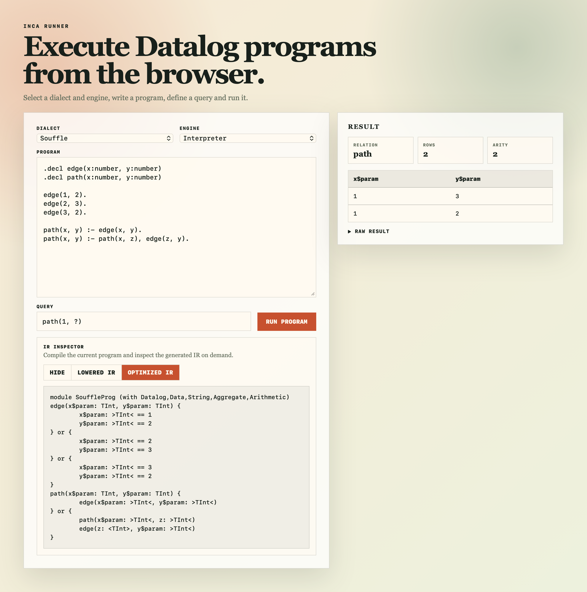

# Datalog IR Web

A browser-based runner for the Datalog IR. The app combines an Angular frontend with a Spring Boot backend that compiles and executes programs through the Datalog IR project.



## Features

- Select a Datalog dialect: Datalog, Functional IncA, OODL, or Soufflé
- Select an execution engine: Viatra, Soufflé, Interpreter, DDLog, or Ascent
- Load sample programs per dialect
- Enter and run queries such as `R(?, 4)` or `main(1, "A")`
- Display query results in a table
- Inspect lowered and optimized IR on demand

## Project Structure

```text
.
|-- frontend/          Angular application
|-- src/main/java/     Spring Boot API
|-- src/main/resources Spring Boot resources and compiler options
|-- docker/            Docker build setup
```

## Requirements

Local development requires:

- Java 17 or newer
- Maven
- Node.js supported by Angular 22, for example Node 24.15.0 or 26.x
- Datalog IR (aka IncA) Maven artifacts available in the local Maven repository

The frontend development server proxies API calls to the backend through `frontend/proxy.conf.json`.

## Run Locally

Start the backend from the project root:

```bash
mvn spring-boot:run
```

Start the frontend in a second terminal:

```bash
cd frontend
npm install
npm start
```

Open the app at:

```text
http://localhost:4200
```

The Spring Boot API runs at:

```text
http://localhost:8080
```

## Docker

A Docker setup is available for building a self-contained image that includes all Datalog engines, IncA dependencies, and the Angular frontend.

```bash
docker compose up --build
```

Then open:

```text
http://localhost:8080
```

Since the Docker build installs external compiler/runtime dependencies and publishes the IncA artifacts locally inside the image, the first build can take a while.
